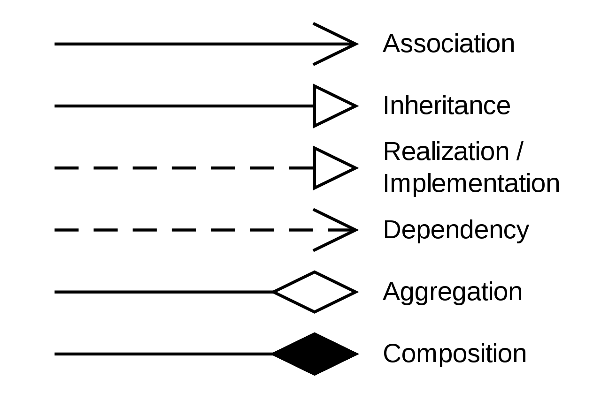
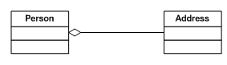
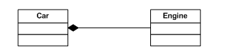

# Association, Aggregation, Composition in C#
The difference between aggregation and composition is pretty fuzzy and AFAIK relates to the logical existence of the "child" objects after the container is destroyed. Hence, in the case of aggregation the objects inside the container can still exist after the container object is destroyed, while in the case of composition design demands that they also get destroyed. Some analogies:

A Car object containing four Wheel objects. Normally if you destroy the car (by calling some method to clean it up) you should also destroy the wheels in the process, since it makes little sense for them to exist outside the car (unless you move them to another Car object). More realistically, a reader object wrapping an input stream will also close the inner stream when it gets closed itself. This is composition.
A Person object contains (owns) a Radio object. If the Person dies, the Radio may be inherited by another Person i.e. it makes sense for it to exist without the original owner. More realistically, a list holding objects does not demand that all objects get disposed when the list itself is disposed. This is aggregation.
Edit: After reading your links I'd be inclined to go with the first one, since it gives an explanation similar to mine.

Also association is merely invoking a method (sending a message) to another object via a reference to that object.

If inheritance gives us 'is-a' and composition gives us 'part-of', we could argue that aggregation gives us a 'has-a' relationship.

==> In short, Association, Aggregation, and Composition are terms that represent relationships among objects.

UML Relations Notation



___1.Association:___ Association means that an object "uses" another object. As you said: "Association is a weaker form of Aggregation where the class doesn't keep a reference to the object it receives." There are two objects that know about each other, but they can't affect to each other's lifetime.

The software firm may have external caterers serving food to the employees. These caterers are NOT PART OF the firm. However, they are ASSOCIATED with the firm. The caterers can exist even if our software firm is closed down. They may serve another firm! Thus the lifetime of caterers is not governed by the lifetime of the software firm. This is typical ASSOCIATION

```C#
public class Association
{
    //SomeUtilityClass _obj   /*NO local reference maintained */
    public void doSomething(SomeUtilityClass obj)
    {
       obj.DoSomething();
    }
}
```
___2.Aggregation:___

Consider a Car manufacturing unit. We can think of Car as a whole entity and Car Wheel as part of the Car. (at this point, it may look like composition..hold on) The wheel can be created weeks ahead of time, and it can sit in a warehouse before being placed on a car during assembly. In this example, the Wheel class's instance clearly lives independently of the Car class's instance. Thus, unlike composition, in aggregation, life cycles of the objects involved are not tightly coupled.

* Aggregation is a special type of ___Association.___
* Aggregation is ___"has-a"___ relationship among objects (white diamond)
* For example, Person 'has-a' Address.
```C#
public class Address  
{  
 . . .  
}  
public class Person  
{  
     private Address address;  
     public Person(Address address)  
     {  
         this.address = address;  
     }  
     . . .  
}
```

As you can see, the ___Person___ does not manage the lifetime of Address. If the Person is destroyed, the Address still exists.


__3.Composition__
Composition is a special type of Aggregation, It is a strong type Aggregation.
Composition gives us a 'part-of' relationship(dark diamond). Ex: Engine is part-of a car

Imagine a software firm that is composed of different Business Units (or departments) like Storage BU, Networking BU. Automobile BU. The life time of these Business Units is governed by the lifetime of the organization. In other words, these Business Units cannot exist independently without the firm. This is COMPOSITION. (ie the firm is COMPOSED OF business units)

```C#
public class Engine  
{  
 . . .   
}  
public class Car  
{  
    Engine e = new Engine();  
    .......  
}
```


* https://www.c-sharpcorner.com/UploadFile/ff2f08/association-aggregation-and-composition/
* https://www.c-sharpcorner.com/article/difference-between-composition-and-aggregation/